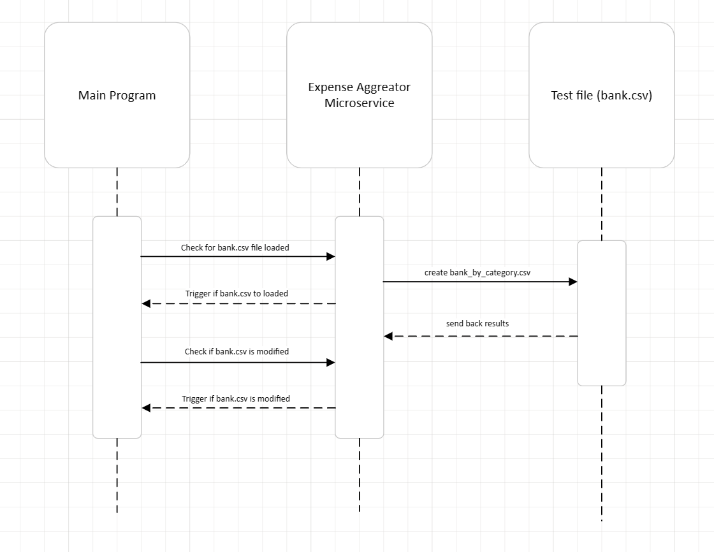

# ExpenseAggregatorMicroService

## Communication Contract:

### How to REQUEST data:
- The Expense Aggregator microservice is requested by sending a file location of the a bank statement (saved as a .csv file) through a ZeroMQ socket. 

## Example Input .csv file

### How to RECEIVE data:
- When the Expense aggregator microservice is requested, the microservice aggregates the bank statement from the file path received by category and saves the results to the 'bank_by_category.csv" which is saved in the same directory as the file path requested.

## Example Output .csv file

## UML

